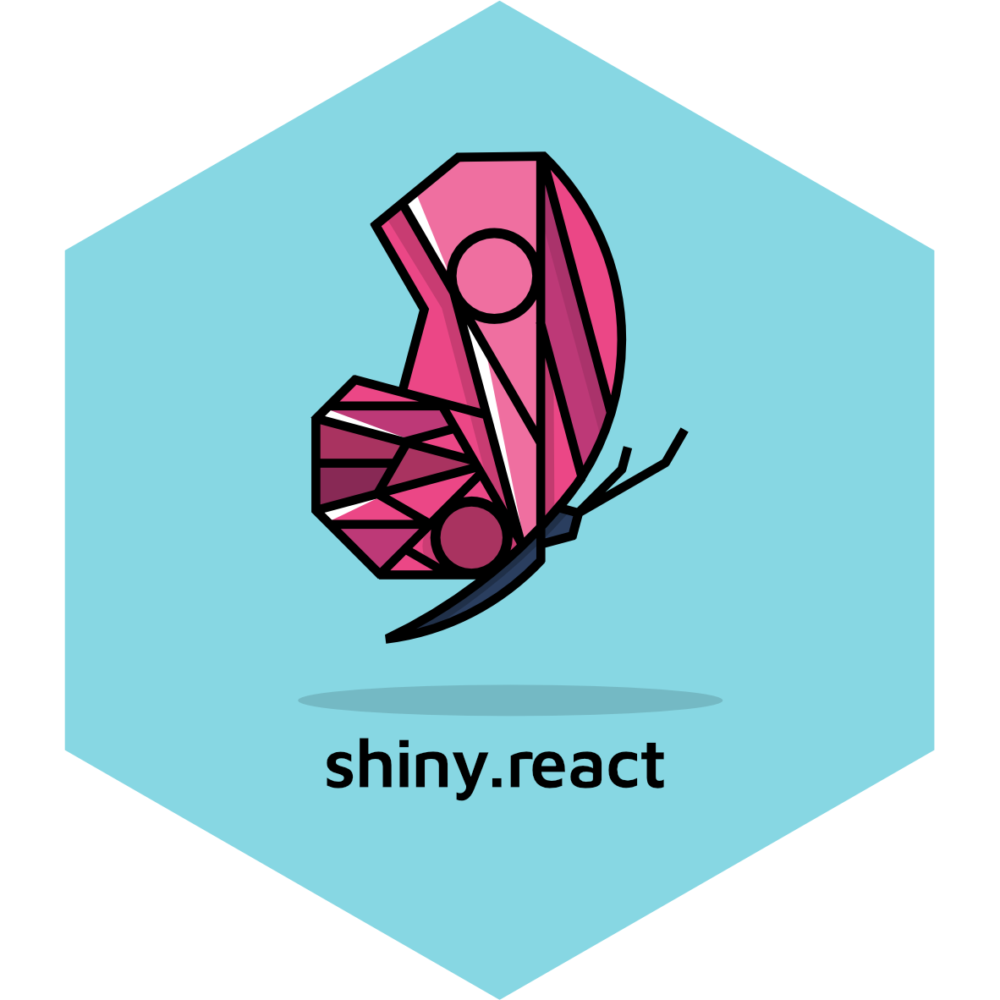

# shiny.react <a href="https://appsilon.github.io/shiny.react/"></a>

> _Use React in Shiny applications._

<!-- badges: start -->
[](https://cran.r-project.org/package=shiny.react)
[](https://CRAN.R-project.org/package=shiny.react)
[](https://CRAN.R-project.org/package=shiny.react)
[](https://github.com/Appsilon/shiny.react/actions/workflows/ci.yaml)
<!-- badges: end -->

This R package enables using React in Shiny apps and is used e.g. by the [`shiny.fluent`](https://appsilon.github.io/shiny.fluent/) package.
It contains R and JS code which is independent from the React library (e.g. Fluent UI) that is being wrapped.

## Installation

Stable version:

```r
install.packages("shiny.react")
```

Development version:

```r
remotes::install_github("Appsilon/shiny.react")
```

## Development

To build and install the package, run:
```sh
(cd js && yarn && yarn webpack)
Rscript -e 'devtools::document(); devtools::install()'
```

## Testing

* `cd js && yarn lint` lints the JS code
* `cd js && yarn test` runs the unit tests for the JS code
* `Rscript -e "lintr::lint_package()"` runs linter for the R code
* `Rscript -e "devtools::test()"` runs unit tests for the R code

## How to contribute?

If you want to contribute to this project please submit a regular PR, once you're done with a new feature or bug fix.

Reporting a bug is also helpful - please use [GitHub issues](https://github.com/Appsilon/shiny.react/issues) and describe your problem as detailed as possible.

## Appsilon


Appsilon is a **Posit (formerly RStudio) Full Service Certified Partner**.<br/>
Learn more
at [appsilon.com](https://appsilon.com).

Get in touch [opensource@appsilon.com](opensource@appsilon.com)

Check our [Open Source tools](https://shiny.tools).

<a href = "https://appsilon.com/careers/" target="_blank"></a>
